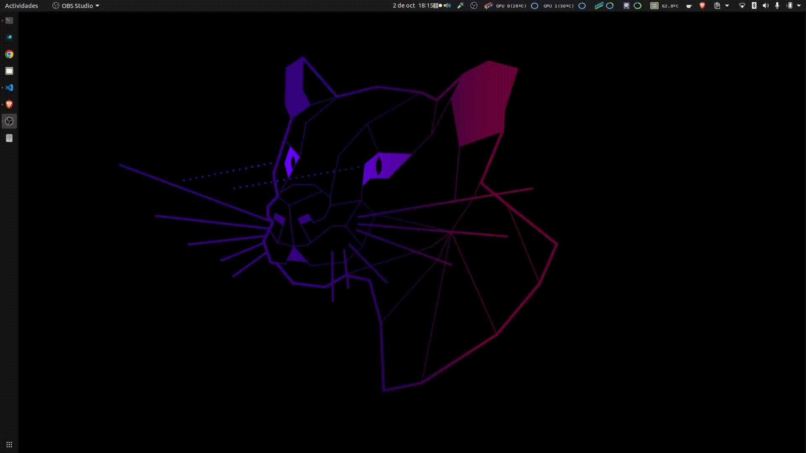

# Output Audio Device Manager

Switch the system's default audio output device from a single click in the Ubuntu/GNOME tray. Split into a small backend daemon that wraps `pactl` and exposes an HTTP/SSE API, plus a system-tray frontend that renders the device list as a menu.



## Architecture

```
+-------------------+       HTTP/SSE        +----------------------+
|   audio-monitord  | <-------------------- |  audio-monitor-tray  |
|  (pactl sampler)  |   /v1/stream JSON     |   (ksni + reqwest)   |
+-------------------+                       +----------------------+
        ^                                            ^
        | pactl                                      | DBus (StatusNotifierItem)
        v                                            v
   PulseAudio / PipeWire                      GNOME / KDE panel
```

Both binaries are written in Rust. They live in a single Cargo workspace under `crates/`:

- `audio-monitor-core` — shared `Snapshot` / `Sink` / `SinkState` types serialised with `serde`.
- `audio-monitord` — backend daemon. Calls `pactl list sinks` and `pactl info` every second on a tokio task, holds the latest snapshot in a `watch` channel, serves it over REST + Server-Sent Events. `POST /v1/sinks/default` triggers `pactl set-default-sink`. Defaults to `127.0.0.1:9128`.
- `audio-monitor-tray` — Linux system-tray frontend. Subscribes to `/v1/stream`, renders a menu listing every sink with a `●` next to the active one, and POSTs back to the daemon when the user clicks one. Static `speaker.png` icon in the panel.

Splitting daemon from UI keeps the click→action latency low (the tray never blocks on `pactl`) and makes it possible for a remote frontend (Mac, Windows, web) to consume the same API later — only the local Linux tray is implemented today.

### Sister monitors

This monitor lives alongside the rest of the `system_monitor` family — they share the `*-monitord` + `*-tray` pattern and use distinct ports so they can run in parallel:

| Monitor | Port | Repo |
|---|---|---|
| GPU | 9123 | [`gpu_monitor`](https://github.com/maximofn/gpu_monitor) |
| CPU | 9124 | [`cpu_monitor`](https://github.com/maximofn/cpu_monitor) |
| RAM | 9125 | [`ram_monitor`](https://github.com/maximofn/ram_monitor) |
| Disk | 9126 | [`disk_monitor`](https://github.com/maximofn/disk_monitor) |
| Input audio | 9127 | [`input_audio_device`](https://github.com/maximofn/input_audio_device) |
| **Output audio** | **9128** | this repo |

## Performance

The daemon spawns a `pactl` subprocess once per sample interval (default 1s) and the tray only redraws on snapshot delta. Idle resource use is dominated by tokio + axum (~5 MB RSS for the daemon, ~10 MB RSS for the tray), well under the legacy GTK script.

## Build

The toolchain is pinned to `stable` via `rust-toolchain.toml`; rustup will install it on demand.

```bash
cargo build --release --workspace
cargo test --workspace
```

Required system packages (Ubuntu/Debian):

```bash
sudo apt install pulseaudio-utils    # gives us /usr/bin/pactl
# build deps for the tray (DBus + system fonts):
sudo apt install build-essential pkg-config libdbus-1-dev
```

## Run manually

```bash
./target/release/audio-monitord                   # listens on 127.0.0.1:9128
./target/release/audio-monitor-tray               # connects to 127.0.0.1:9128
```

Without PulseAudio (CI, dev on another box):

```bash
./target/release/audio-monitord --mock
```

Inspect the API directly:

```bash
curl http://127.0.0.1:9128/v1/snapshot | jq
curl http://127.0.0.1:9128/v1/sinks    | jq
curl -X POST -H 'content-type: application/json' \
     -d '{"name":"alsa_output.pci-0000_0c_00.4.iec958-stereo"}' \
     http://127.0.0.1:9128/v1/sinks/default
```

## Install (user-level)

Copies the release binaries into `~/.local/bin`, registers a `systemd --user` service for the daemon, drops a `.desktop` autostart entry for the tray, and starts both immediately.

```bash
cargo build --release --workspace
./packaging/install.sh
```

After install:

- `systemctl --user status audio-monitord` — daemon health
- `systemctl --user restart audio-monitord` — restart after rebuilding the daemon
- The tray is **not** a systemd unit (it needs the graphical session). To pick up a new tray binary without logging out:

  ```bash
  install -m 0755 target/release/audio-monitor-tray ~/.local/bin/
  pkill -f "$HOME/.local/bin/audio-monitor-tray$" || true
  nohup ~/.local/bin/audio-monitor-tray >/dev/null 2>&1 & disown
  ```

To remove everything: `./packaging/uninstall.sh`.

## API summary

| Method | Path | Body | Response |
|---|---|---|---|
| GET | `/healthz` | — | `{ "status": "ok", "uptime_s": N }` |
| GET | `/v1/info` | — | backend & API metadata |
| GET | `/v1/snapshot` | — | full `Snapshot` (host, default sink, sink list) |
| GET | `/v1/sinks` | — | list of `Sink` |
| GET | `/v1/sinks/default` | — | `{ "default_sink": "name" }` |
| POST | `/v1/sinks/default` | `{ "name": "<sink-name>" }` | fresh `Snapshot` after the switch |
| GET | `/v1/stream` | — | SSE stream of `Snapshot` events |

The schema is versioned in the path (`/v1/...`); a breaking change bumps the prefix.

## Legacy Python script

`output_audio_device.py` is the original GTK/AppIndicator implementation. It still runs (`./output_audio_device.sh`) and is kept for reference until the Rust binaries have been in production for a release cycle. They can coexist with the Rust version on the same machine — the tray icons live next to each other.

## Support

Consider giving a **☆ Star** to this repository, if you also want to invite me for a coffee, click on the following button:

[](https://www.buymeacoffee.com/maximofn)
